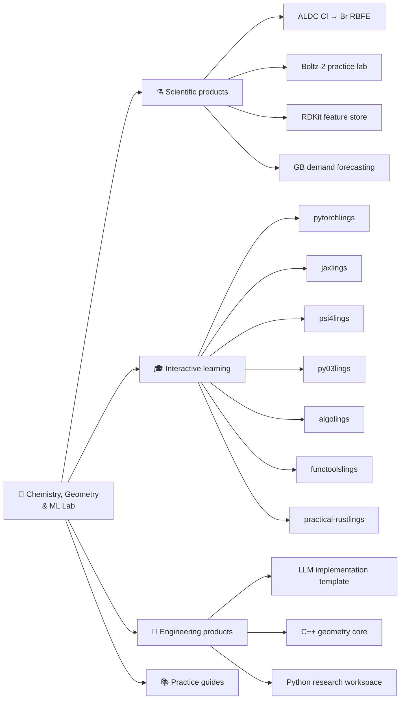
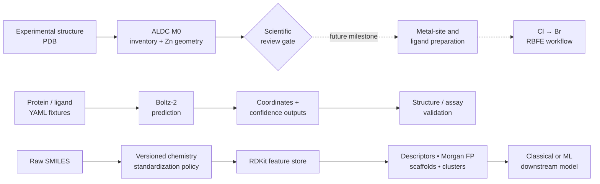
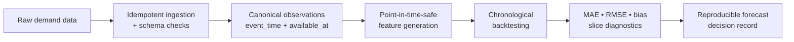
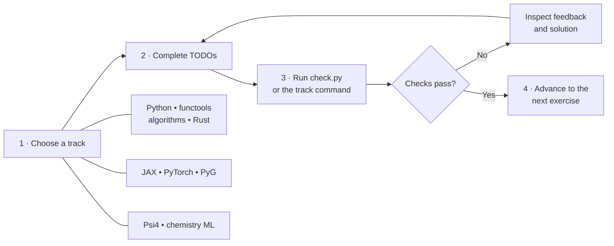
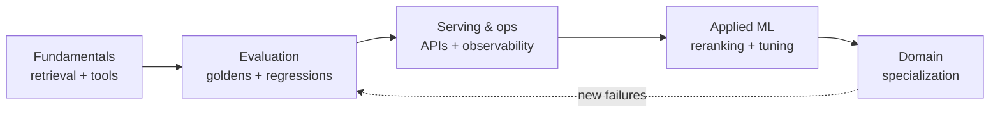
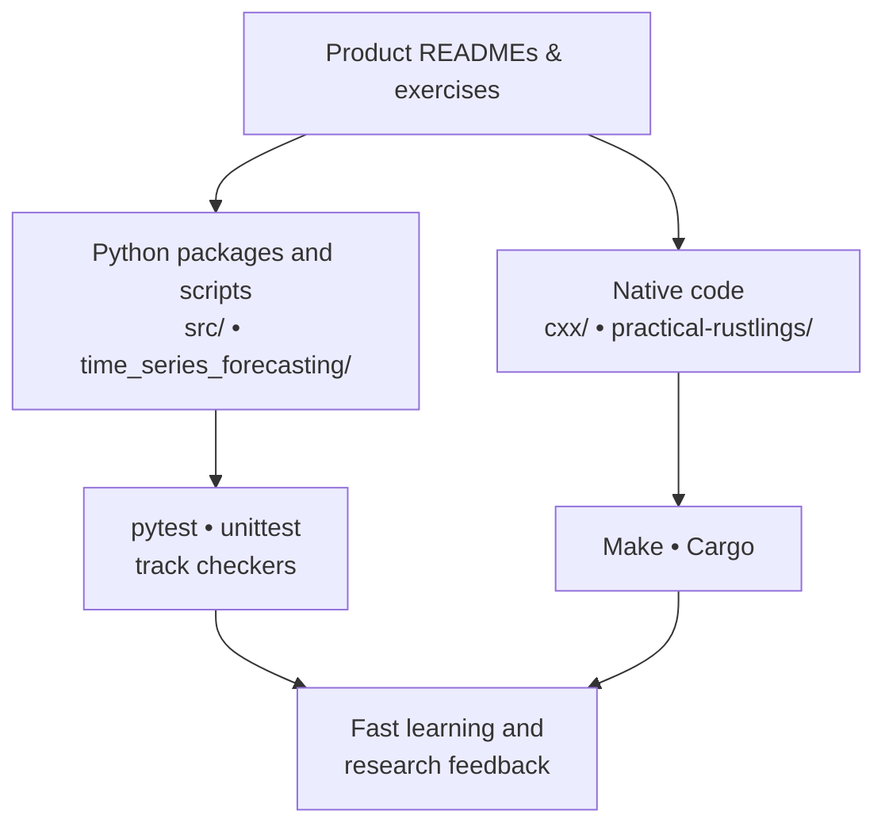

<div align="center">

# Chemistry, Geometry & ML Lab

**A hands-on portfolio of computational chemistry, molecular ML, scientific software, and learn-by-fixing exercise tracks.**

[](pyproject.toml)
[](cxx/README.md)
[](practical-rustlings/README.md)
[](jaxlings/README.md)
[](pytorchlings/README.md)

<sub>Explore a product below, open its README, and follow the local quick-start.</sub>

</div>

---

## Portfolio map



## Products at a glance

| Product | What it is | Start here |
| --- | --- | --- |
| **ALDC Cl → Br RBFE** | Milestone-gated reconstruction of a Zn-containing enzyme relative-binding free-energy study; M0 currently inventories and measures the supplied structure. | [`aldc-cl-br-rbfe/README.md`](aldc-cl-br-rbfe/README.md) |
| **Boltz-2 practice lab** | Small monomer, protein-complex, and protein–ligand fixtures for learning prediction and responsible result interpretation. | [`boltz2-practice/README.md`](boltz2-practice/README.md) |
| **RDKit small-molecule feature store** | Vendor-neutral molecule parsing, normalization, descriptors, fingerprints, clustering, and diversity selection. | [`docs/rdkit_feature_store.md`](docs/rdkit_feature_store.md) |
| **GB demand forecasting lab** | Leakage-aware, point-in-time-correct forecasting exercises with generated half-hourly demand and standard-library baselines. | [`time_series_forecasting/README.md`](time_series_forecasting/README.md) |
| **pytorchlings** | Fix-the-code curriculum spanning PyTorch, PyG, chemistry ML, graph learning, Lightning, and chemistry LLMs. | [`pytorchlings/README.md`](pytorchlings/README.md) |
| **jaxlings** | Progressive exercises in arrays, transformations, autodiff, pytrees, training, device mapping, and checkpointing. | [`jaxlings/README.md`](jaxlings/README.md) |
| **psi4lings** | Quantum-chemistry exercises from molecular setup and SCF through optimization, vibrations, properties, and scans. | [`psi4lings/README.md`](psi4lings/README.md) |
| **py03lings** | Python fundamentals through async, data engineering, systems concepts, and object-oriented design. | [`py03lings/README.md`](py03lings/README.md) |
| **algolings** | Core algorithms track covering search, hashing, graphs, shortest paths, disjoint sets, and dynamic programming. | [`algolings/README.md`](algolings/README.md) |
| **functoolslings** | Focused practice for `reduce`, `partial`, decorators, caching, dispatch, ordering, and integration. | [`functoolslings/README.md`](functoolslings/README.md) |
| **practical-rustlings** | Broad Rust practice from ownership fundamentals to Tokio, systems programming, and numerical FFI. | [`practical-rustlings/README.md`](practical-rustlings/README.md) |
| **LLM implementation template** | A staged blueprint for a reliable LLM application: fundamentals, evaluation, serving, deeper ML, and specialization. | [`llm_implementation_template/README.md`](llm_implementation_template/README.md) |
| **C++ geometry core** | The original reusable geometry implementation, examples, and application entry point. | [`cxx/README.md`](cxx/README.md) |
| **Python research workspace** | Exploratory PyTorch, chemistry, simulation, and platform-engineering source organized under `src/`. | [`src/README.md`](src/README.md) |

## Scientific systems

### Molecular modelling and discovery

The scientific projects deliberately separate **inputs**, **computation**, **quality checks**, and **claims**. The ALDC project is milestone-gated: its current M0 geometry report is a structural baseline, not an RBFE result.



> [!IMPORTANT]
> Predicted structures, confidence values, geometric contacts, and computed molecular features are not experimental evidence of binding or biological function. Read each product's evidence boundaries before interpreting output.

### Forecasting system



The included worked example uses generated data and only the Python standard library, so the core mechanics can be explored before connecting a production data source.

## Learn-by-fixing tracks

Every `*lings` Python track follows the same loop: open an exercise, replace its `TODO`s, run the checker, then compare with the corresponding solution. Dependencies vary by track.



### Suggested learning routes

| Goal | Route |
| --- | --- |
| **Scientific Python foundations** | [`py03lings`](py03lings/README.md) → [`functoolslings`](functoolslings/README.md) → [`algolings`](algolings/README.md) |
| **Modern differentiable ML** | [`jaxlings`](jaxlings/README.md) → [`pytorchlings`](pytorchlings/README.md) → [`src/pytorch_practice`](src/README.md) |
| **Computational chemistry + ML** | [`psi4lings`](psi4lings/README.md) → [RDKit feature store](docs/rdkit_feature_store.md) → [`pytorchlings`](pytorchlings/README.md) → [ALDC RBFE](aldc-cl-br-rbfe/README.md) |
| **Systems breadth** | [`practical-rustlings`](practical-rustlings/README.md) → [C++ geometry](cxx/README.md) → [LLM implementation template](llm_implementation_template/README.md) |

## Engineering blueprints

### Reliable LLM application lifecycle



### Repository runtime layers



## Practice packs and roadmaps

These standalone guides complement the runnable products:

- [Modern deep-learning research exercises](modern_deep_learning_research_exercises.md) — GNN, Transformer, and diffusion research practice.
- [Force-field coarse-graining exercises](force_field_coarse_graining_exercises.md) — multiscale molecular-modelling practice.
- [PyG exercise roadmap](pyg_exercise_roadmap.md) — a structured graph-learning progression.
- [Data-engineering interview pack](data_engineering_interview_practice_pack.md) — practical data-system interview preparation.
- [SQL performance exercises](sql_performance_complex_query_exercises.md) — complex-query and performance practice.

## Quick start

```bash
# Clone and enter the repository, then install the root Python project
python -m pip install -e .
python -m pip install pytest

# Run the root test suite
pytest

# Or start with a dependency-light learning track
python algolings/check.py
python py03lings/check.py

# Run the dependency-free forecasting example
python time_series_forecasting/example.py
```

Most scripts are exploratory and runnable independently. For JAX, PyTorch/PyG, Psi4, Boltz-2, OpenMM, or other specialist tools, follow the environment notes in that product's README instead of installing everything into one environment.

## Legacy C++ build

The top-level `Makefile` builds the original geometry executable:

```bash
make
./main
```

The compiler requires the configured Eigen headers and `spdlog` library. See the [C++ layout](cxx/README.md) before extending the native code.

## Repository conventions

- Treat each product README as the source of truth for its setup, scope, and scientific limitations.
- Keep generated model weights, trajectories, predictions, and other large artifacts out of Git unless a product explicitly documents otherwise.
- Prefer reproducible commands, seeded examples, versioned inputs, and tests over notebook-only results.
- Do not infer scientific conclusions beyond what a product's current milestone and validation evidence support.
