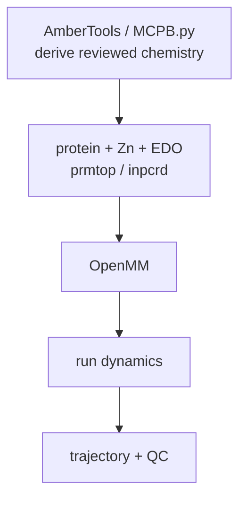

# Metal-site work and MCPB.py handoff

This directory is scaffolded for M1. M0 does not parameterize Zn, produce QM outputs,
or run MD. Begin only after review of the coordinate-derived M0 reference and explicit
scientific decisions about assembly, protonation, EDO treatment, and Zn methodology.



MCPB.py is a scientific workflow, not a format converter. First record the biological
assembly, protonation states, EDO charge method, Zn model type and coordinating atoms,
QM method/basis, and charge/multiplicity. Preserve the MCPB input, generated parameter
files, QM inputs/outputs, and logs here. Run its four stages (`-s 1` through `-s 4`)
with the reviewed input and inspect each stage before continuing. The final `tleap`
build must load those parameters and write one solvated `prmtop`/`inpcrd` pair under
`systems/edo_reference/`; never fabricate missing QM output.

Validate the handoff without OpenMM installed:

```bash
python md/run_openmm.py \
  --prmtop systems/edo_reference/edo_reference.prmtop \
  --inpcrd systems/edo_reference/edo_reference.inpcrd \
  --output-dir md/edo_reference --dry-run
```

After review, remove `--dry-run` to minimize and run seeded NPT dynamics. Outputs are
`trajectory.dcd`, `state.csv`, `final.pdb`, `final.chk`, and `qc.json`. The QC summary
only confirms thermodynamic-trace collection; coordination distances, drift,
equilibration, and independent replicas still require analysis.
